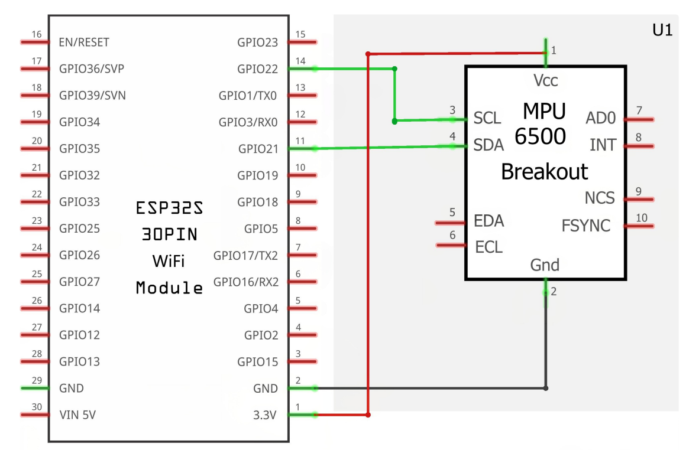

# IMU Telemetry Visualizer

A real-time, wireless 3D motion tracking system built with an ESP32 and an MPU-6500 Inertial Measurement Unit (IMU). The microcontroller processes raw accelerometer and gyroscope data using a complementary filter, transmitting Roll, Pitch, and Yaw telemetry over WiFi via UDP. A Python script receives this data to render a live, low-latency 3D visualization of the board's orientation in the browser.

## Features
*   **Wireless Telemetry:** Streams orientation data over a local WiFi network via UDP.
*   **Live 3D Visualization:** Renders the physical board movements in real-time using the `vpython` library.
*   **Auto-Calibration:** Automatically calculates gyroscope offsets on startup with visual LED status feedback.
*   **Custom Sensor Fusion:** Implements a complementary filter to merge accelerometer and gyroscope data.

## Hardware Requirements
*   ESP32 Development Board
*   MPU-6500 (or MPU-6050) 6-DOF IMU Sensor
*   Breadboard and jumper wires

### Wiring / Pinout


| ESP32 Pin | MPU-6500 Pin | Function |
| :--- | :--- | :--- |
| `3V3` | `VCC` | Power |
| `GND` | `GND` | Ground |
| `GPIO 21` | `SDA` | I2C Data |
| `GPIO 22` | `SCL` | I2C Clock |

## Software Prerequisites
1.  **C++ / Firmware:** VS Code with PlatformIO (or Arduino IDE) to flash the ESP32.
2.  **Python 3.x:** Installed on the host PC.
3.  **VPython:** Install the visualization library via pip:
    ```bash
    pip install vpython
    ```

## Getting Started

### 1. Configure the Firmware
Open `main.cpp` and update the network configuration variables to match your local network and the IP address of the PC running the Python script:
```cpp
const char* ssid = "YOUR_WIFI_SSID";
const char* password = "YOUR_WIFI_PASSWORD";
const char* targetIP = "YOUR_PC_IP_ADDRESS";
```

### 2. Flash and Calibrate
Compile and upload the code to the ESP32.

Critical: Lay the hardware perfectly flat and stationary during initialization. The system requires several seconds to calculate the baseline gyroscope error.

### 3. Launch the Visualizer
Run the Python receiver script on your host PC: `receiver.py`

A browser window will automatically open displaying the live 3D orientation of the hardware.

When the onboard LED begins continuously blinking, calibration is complete and the UDP data loop is running.

## Notes and Limitations

### Gimbal Lock
This project calculates orientation using Euler angles (Roll, Pitch, Yaw). As a mathematical consequence, an issue known as Gimbal Lock occurs when the board reaches a pitch angle of exactly ±90°, causing the Roll and Yaw axes to align and losing a degree of freedom.

To mitigate this effect, the firmware implements a conditional threshold in the complementary filter:

*    **When Pitch is < 80°:** The filter relies heavily on the gyroscope for smooth movement, using the accelerometer to correct long-term drift.

*    **When Pitch is > 80°:** Accelerometer data is actively ignored to prevent atan2 calculation errors, relying 100% on gyroscope integration.

**Limitation:** If the board is held at > 80° pitch for extended periods, the roll orientation will slowly drift due to the lack of accelerometer correction.

A solution involving quaternions rather than Euler angles to determine orientation has been considered for a potential V2 of this project.

